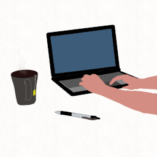

# Bem-vindo ao meu GitHub! 👋

Sobre mim
💻 Tecnologias que utilizo: JavaScript, Node.js, React, entre outras.
🌱 Aprendizado contínuo: Atualmente me aprofundando em JavaScript
📈 Objetivo: Construir soluções inovadoras, aprender com a comunidade e colaborar em projetos open-source.
O que você vai encontrar aqui?
🛠️ Projetos pessoais: Soluções práticas para problemas cotidianos e experimentos de novas tecnologias.
💬 Contribuições open-source: Colaborações com a comunidade para criar algo melhor.
📚 Documentação e tutoriais: Compartilhando o que aprendi para ajudar outros desenvolvedores.
